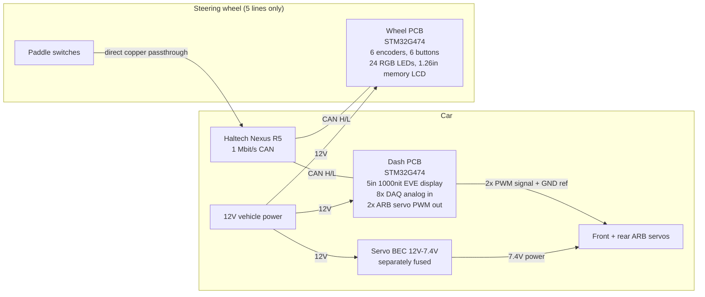

# System Architecture & CAN Protocol — FSAE Wheel / Dash / Sim

> **Permanent memory file.** This is the contract between the hardware, the firmware, and the
> Haltech Nexus R5. Change nothing here without re-verifying on a bench bus (see engineering-rigor.md).

## 1. System topology



- **One CAN bus**, Haltech's, at **1 Mbit/s, 11-bit IDs, big-endian data** (Haltech Broadcast Protocol spec §2).
- **Both boards are powered from vehicle 12V and regulate locally.** The wheel is standalone: it does
  not depend on the dash existing. Never take power from an ECU sensor supply (hardware-selections.md §0.2).
- Paddles are copper from wheel connector to Nexus digital inputs. The wheel PCB only adds TVS + a 100k sense tap.
- **Servo power never touches the dash PCB** — signal and ground reference only (hardware-selections.md §9.1).

### CAN termination policy
A CAN bus needs exactly two 120Ω terminations at the physical extremes. The Nexus provides one (via
the Haltech hub/harness). **Both our boards carry DNP split-termination footprints (2×60.4Ω + 4.7nF);
populate only on whichever board is physically at the far end of the bus in the actual car harness.**
The wheel's coiled cable is a stub off the main bus; keep it < 0.5 m (at 1 Mbit/s the conventional
stub limit is ~0.3–0.6 m — measure and keep the wheel drop short).

## 2. How the Nexus "picks up" every input (the emulation strategy)

The Nexus R5 does not ingest arbitrary CAN frames easily, but it natively supports Haltech's own CAN
devices. The wheel therefore **impersonates two devices the ECU already knows**:

### 2.1 Buttons + LED feedback = Haltech CAN Keypad emulation
Haltech's keypads are Blink Marine PKP units speaking **CANopen**. Verified protocol (Blink
PKP2600SI CANopen manual rev 1.5, cross-checked against HPA forum reference):

| Function | CAN ID | Payload |
|---|---|---|
| Boot-up (on power) | `0x700 + NodeID` | 1 byte `0x00` — announces keypad, NSP detects it |
| NMT start (ECU → keypad) | `0x000` | `[0x01, NodeID]` — keypad must not send key states until received |
| Key states (keypad → ECU) | `0x180 + NodeID` | B0: keys 1–8 bitmap, B1: keys 9–12 (low nibble), B4: 100 ms tick counter |
| LED ON (ECU → keypad) | `0x200 + NodeID` | B0: red 8–1, B1: green 4–1 + red 12–9, B2: green 12–5, B3/B4: blue |
| LED blink (ECU → keypad) | `0x300 + NodeID` | same bit layout |
| LED brightness | `0x400 + NodeID` | B0: 0x00–0x3F |
| Backlight | `0x500 + NodeID` | B0 brightness, B1 color code |
| SDO (config) | rx `0x600+ID` / tx `0x580+ID` | Object 2010h baud, 2013h node ID, 2011h boot-up, 1017h heartbeat |

- **Node ID: default `0x15`** (Blink factory default, confirmed by MaxxECU docs). Haltech-branded
  units ship reconfigured for the 1 Mbit Haltech bus. **Firmware must make NodeID and the emulated
  model (12-key vs 15-key) config constants**, and the *first bench task* is sniffing a real
  Haltech-configured keypad or NSP's discovery traffic to confirm the expected NodeID — flagged in
  engineering-rigor.md as **assumption A1**.
- Our 6 physical buttons map to keys 1–6. **Encoder detents can additionally be mapped to virtual
  key pairs** (e.g. thumb encoder 1 CW = key 7 momentary pulse, CCW = key 8) — NSP exposes keypad
  keys as momentary inputs that can drive trim up/down functions. This gives *relative* encoder
  control on top of the absolute mechanism below.
- ECU→keypad LED frames drive our button backlight/status LEDs (map the red/green/blue bitmaps onto
  the WS2812 chain positions handling button halos) — the tuner's NSP LED config just works.

### 2.2 Encoder absolute positions = Haltech IO12 Expander emulation
Haltech's Rotary Trim Modules are *analog resistor ladders into AVI inputs* — i.e. to the ECU, a
"map switch" is just a voltage. The IO 12 Expander (Box A) puts 4 AVI voltages on CAN. Protocol
(verified from PT Motorsport's open-source IObox emulator, 1 Mbit/s):

| Function | CAN ID | Rate | Payload |
|---|---|---|---|
| AVI 1–4 (box → ECU) | `0x2C1` | 20 ms | four big-endian u16, **0–4095 ≙ 0–5V** |
| DPI 1–2 states | `0x2C3` | 20 ms | B0 = DPI1 (0/250), B4 = DPI2 |
| DPI 3–4 states | `0x2C5` | 20 ms | B0 = DPI3, B4 = DPI4 |
| Keep-alive | `0x2C7` | 100 ms | `10 09 0A 00 00` |
| DPO 1–2 (ECU → box) | `0x2D1` | — | output commands (we ignore) |
| DPO 3–4 (ECU → box) | `0x2D3` | — | output commands (we ignore) |

- Each of up to **4 encoders gets an AVI channel**: firmware converts detent position 0…N-1 to
  `raw = position × 4095/(N-1)`, i.e. a perfect synthetic rotary-trim voltage with zero contact
  resistance error. In NSP, the tuner maps "IO12A AVI1" to e.g. *Boost Trim* exactly as if a
  physical trim module were wired in.
- Remaining encoders (we have up to 6) use the keypad virtual-key mechanism (§2.1) or Box B
  (`HT-059901`). **Box B CAN IDs are not publicly documented — assumption A2**: request the write
  protocol from Haltech support (they provide it to owners) or sniff a Box B before relying on it.
- The DPI channels are spare capacity: they can carry 4 more switch states if we ever exceed 12 keypad keys.

### 2.3 Dash telemetry = Haltech Broadcast Protocol (receive-only)
From the official spec (V2, 1 Mbit/s, 11-bit, big-endian, temperatures in 0.1 K, pressures absolute 0.1 kPa):

| ID | Rate | Channels the dash uses |
|---|---|---|
| `0x360` | 50 Hz | RPM (B0–1), MAP (B2–3), TPS (B4–5) |
| `0x361` | 50 Hz | Fuel pressure (B0–1), Oil pressure (B2–3) |
| `0x368` | 20 Hz | Lambda 1 (B0–1, ×0.001) |
| `0x36C` | 20 Hz | Wheel speeds FL/FR/RL/RR (×0.1 km/h) |
| `0x370` | 20 Hz | Vehicle speed (B0–1), **Gear** (B2–3: 0=N, 1=1st…) |
| `0x372` | 10 Hz | **Battery voltage** (B0–1, ×0.1 V) |
| `0x3E0` | 5 Hz | **Coolant temp** (B0–1), **Air temp** (B2–3), Fuel temp (B4–5), **Oil temp** (B6–7) — all 0.1 K |
| `0x3E1` | 5 Hz | Trans temp (B0–1), Diff temp (B2–3) |
| `0x3E4` | 5 Hz | Status bits: MIL (7:0), battery light (7:1), limp mode (7:2) etc. |

Conversion: `°C = raw×0.1 − 273.15` (temps), `kPa gauge = raw×0.1 − 101.3` (pressures).
The **wheel also listens** to `0x360` (RPM → shift lights) and `0x370` (gear → display), and to
`0x3E4`/TC-related status for the TC and lockup bars. Which exact channel drives TC/lockup lights is
an NSP-configuration decision — bind them to Timed Duty/Generic Output status bits in `0x3E4` or a
dedicated broadcast the tuner enables; firmware makes the source IDs a config table.

## 3. Power budgets (worst case, shown work)

### Wheel (12V input from harness, 1A polyfuse) — **Rev B**
Loads on the local **5V rail** (downstream of the on-board buck):

| Load | Worst case | Basis |
|---|---|---|
| 24 × WS2812B-2020, all full white | 0.86 A | 24 × 36 mA (datasheet class max; **verify by measurement — assumption A3**) |
| Firmware global LED cap | **≤ 0.45 A** | cap aggregate duty ≤50% in driver |
| STM32G474 @ 170 MHz + I/O (via 3.3V LDO) | 0.10 A | datasheet run current + GPIO loads |
| TJA1051 transmitting | 0.07 A | dominant-state supply spec |
| Memory LCD + misc | < 0.01 A | ~µW-class panel |
| **5V rail total (capped)** | **≈ 0.63 A → 3.15 W** | buck output; 1.5A buck rating ✔ (2.4× margin) |

**Reflected to the 12V input** (buck ≈ 90% efficient): 3.15 W / 0.90 / 12 V ≈ **0.29 A**
→ under the 1A polyfuse hold ✔, and **2.2× less current than the 5V-fed Rev A** through the
slip-ring / quick-release contacts.

Contact-degradation check (the reason for 12V — see hardware-selections.md §0.2):

| Contact + cord loop resistance | Drop @ 12V, 0.29 A | Drop @ 5V, 0.63 A (Rev A) |
|---|---|---|
| 150 mΩ (new) | 44 mV — irrelevant | 95 mV of ~600 mV headroom |
| 500 mΩ (worn/oxidised) | **145 mV** of ~7 V headroom — still irrelevant | **315 mV — half the headroom gone** |

Buck needs ≥ ~5.5 V in for 5 V out; arriving voltage stays >11.5 V under any plausible contact wear ✔.

### Dash (12V input) — **Rev B, corrected against Riverdi DS Rev 1.7**
| Load | Rail | Worst case |
|---|---|---|
| Display **backlight** (`BLVDD`) @ 100 % | **5 V** | **0.353 A** — a *separate* module supply, not 3.3 V (see `datasheet-verification.md` §5B) |
| Display module logic (`VDD`) | 3.3 V | 0.098 A typ / 0.384 A max (max is audio-at-full-volume; no speaker fitted) |
| MCU + CAN + analog | 3.3 V | 0.10 A |
| 5V sensor excitation (DAQ) | 5 V | 0.20 A |
| Servo signal buffers | 5 V | < 0.01 A (logic only — servo *power* is external, §3A.2) |
| ~~5V AUX to wheel~~ | — | **removed — wheel is 12V-fed and standalone** |

- **3.3 V rail total: ≈ 0.5 A** (was assumed 1.4 A — the 1.2 A "backlight" was never on this rail).
- **5 V rail total: ≈ 0.6 A direct + 0.37 A reflected from the 3.3 V buck ≈ 1.0 A.**
- **12 V input draw:** ≈ (1.65 W + 3.0 W) / 0.85 eff / 12 V ≈ **0.46 A** → 2 A polyfuse ✔ (ample).

Feed `BLVDD` from **5 V**, not 3.3 V: the backlight driver is constant-current, so at 3.3 V it would
draw 657 mA for the same brightness instead of 353 mA.

### DAQ analog front end (dash, 8 channels)
`AIN → 10k series → [node: 10k to GND ∥ 100nF ∥ BAT54S clamp to 3V3/GND] → ADC pin`
- Divide-by-2: 0–5 V sensor range → 0–2.5 V at ADC (3.3 V full scale leaves 0.8 V of over-range headroom).
- 10k series limits fault current from a 12V-shorted sensor line to ~0.6 mA into the clamps — harmless.
- fc ≈ 1/(2π·5k·100n) ≈ 320 Hz — right for temps/pressures; C is a footprint, retune per channel.
- G474 ADC: use sample time ≥ 92.5 cycles so the 5k Thévenin source impedance settles to 12-bit accuracy
  (STM32 ADC max external impedance table) — **this is why no op-amp buffer is needed**; TLV9004 DNP
  footprints exist if a fast/low-impedance channel is ever required.
- 5V sensor excitation output: polyfused (200 mA) + SMBJ5.0A.

## 3A. Adjustable anti-roll bar (2 servo channels on the dash)

### 3A.1 Control path — reuses existing traffic, no new protocol
The wheel already broadcasts encoder positions as IO12-emulated **AVI voltages on `0x2C1`** (§2.2),
and CAN is multi-master — **the dash hears those frames exactly as the ECU does**. So:

```
Wheel encoder 3 ──┐                                    ┌── AVI3 → front ARB setpoint
                  ├─→ 0x2C1 @ 20 ms ─→ (heard by both) ─┤
Wheel encoder 4 ──┘         ├─→ Nexus: logs as trim ch. └── AVI4 → rear ARB setpoint
                            └─→ Dash: maps to servo PWM
```

Consequences, all free: the driver adjusts ARB from the wheel; the wheel's memory LCD already shows
the value (it renders encoder values by design); the Nexus logs both settings as trim channels
without any extra configuration. **No new CAN IDs, no new firmware protocol.**

Mapping: `pulse_us = PULSE_MIN + (avi_raw / 4095) × (PULSE_MAX − PULSE_MIN)`, with `PULSE_MIN/MAX`
per-channel config constants that *are* the firmware endstops (§3A.3 item 2).

### 3A.2 Electrical summary
Signal-only from the dash: `TIM4_CH1/CH2 (PB6/PB7) → 74AHCT2G125 @5V → 100 Ω → SMAJ5.0A → J1.5/J1.6`
(the power connector, reusing the pins freed by deleting the Rev A 5V AUX feed — **not** the DAQ
connector, whose shared analog returns must stay free of servo signal current).
Servo **power** is a separate 12V→7.4V BEC branch in the harness, independently fused, grounds
starred back to dash GND. Full justification and the 74W arithmetic: hardware-selections.md §9.
Position feedback returns on **AIN7/AIN8** of the existing DAQ front end (no new parts).

### 3A.3 Firmware safety requirements (mandatory)
1. **Hold last position on CAN loss** — never spring to a default. Fail-frozen, not fail-centred.
2. **Endstops** — clamp commanded pulse to per-channel min/max. A servo held against a mechanical
   stop draws stall current until it burns; this is the most likely way to destroy one.
3. **Slew limit** — full travel no faster than ~2 s, so a knob spin cannot slam the linkage.
4. **Divergence alarm** — |commanded − measured| beyond threshold for >500 ms ⇒ dash warning + log.
   This is how a seized linkage, stripped spline, or dead servo announces itself.
5. Servo supply independently fused and killable without taking the dash down.

### 3A.4 Planned follow-on: servo power conditioning board (Rev B+)
The external BEC is deliberately a **harness component for now**, but the intended end state is a
small dedicated **servo power conditioning PCB** — a fourth board in this family. Scope when built:

- 12V → 7.4V (or servo-appropriate) buck sized for **2 × stall current** (~10A class, per A6).
- Bulk capacitance to absorb servo inrush and stall transients so they never reach the dash's
  12V rail or the ECU's — **this is the main reason the board is worth building**: servos are the
  dirtiest load on the car and today they share a battery rail with a display and an analog front end.
- Per-channel fusing/current sense, ideally with current telemetry onto CAN (stall detection in
  hardware, complementing the firmware divergence alarm in §3A.3).
- Reverse/transient protection matching the dash input stage; single-point ground star for the
  servo branch, tied to dash GND (the reference rule in hardware-selections.md §9.1).
- Same STM32G474 platform if it needs intelligence, so it inherits the existing codebase and toolchain.

Until it exists, treat BEC selection, its fusing, and its grounding as **harness design deliverables**,
reviewed under the same gates as the PCBs. Do not let "temporary" mean "unreviewed".

## 4. Firmware architecture notes (both boards, one codebase)

- **HAL:** STM32Cube FDCAN + TIM/DMA (WS2812) + SPI (displays) + USB device (sim). No RTOS needed;
  a 1 kHz superloop with interrupt-driven CAN mailboxes is deterministic and auditable.
- **Wheel tasks:** encoder quadrature (TIM encoder mode ×4, polled push switches), debounce (5 ms),
  keypad-emulation state machine (boot-up → wait NMT start → event-driven TPDO + 100 ms periodic),
  IO12 frames on 20 ms/100 ms timers, RPM ingest → shift pattern, LED driver with global current cap,
  display page render (encoder names/values from a config table).
- **Dash tasks:** broadcast ingest → channel table with timeout/stale flags (show `--` after 500 ms
  without data, never a frozen value — a frozen gauge is a lie), EVE display list render at 20 Hz,
  ADC scan (8 ch, oversampled ×16), **DAQ re-broadcast**: dash transmits its 8 analog channels on CAN
  as an emulated IO12 **Box B** (assumption A2) or logs via NSP generic-sensor mapping — so the Nexus
  can log the DAQ channels too. **ARB servo task:** 50 Hz PWM update from the `0x2C1` setpoints with
  endstop clamp, slew limit, CAN-loss hold, and the feedback divergence alarm (§3A.3).
- **Sim variant:** same board; USB HID gamepad descriptor (buttons 1–16 = buttons + encoder
  detent pulses + paddles, encoders also as absolute axes); CAN stack compiled out; LED/display still
  driven (RPM from SimHub custom serial or HID output report — stretch goal).
- **Config as data:** node IDs, virtual-key maps, AVI scaling, LED thresholds all live in one
  `config.h` / flash page — nothing protocol-shaped is hard-coded in logic.

## 5. Open assumptions (tracked — close before trusting the design)

| # | Assumption | How to close |
|---|---|---|
| A1 | NSP detects an emulated keypad at node 0x15 at 1 Mbit/s | Sniff real Haltech keypad / NSP discovery on bench CAN; adjust NodeID constant |
| A2 | IO12 **Box B** ID set (Box A = 0x2C1/3/5/7 verified via PT Motorsport emulator) | Request write protocol from Haltech support (they supply it to owners) or sniff |
| A3 | WS2812B-2020 worst-case current 36 mA/LED | Measure a 24-LED strip at full white, update budget |
| A4 | TC / lockup status source on broadcast bus | Decide with tuner in NSP; bind config table |
| A5 | Riverdi backlight inrush | **Re-aimed:** the backlight is on `BLVDD`/**5 V**, not 3.3 V (§5B of the verification file), so scope the **5 V rail** at power-on and verify the 60 V buck's soft-start covers it |
| A6 | ARB servo torque/stall current unknown (assumed ~5A stall @7.4V per channel) | Get the actual servo part number from the vehicle dynamics/mechanical team; it sizes the BEC now and the servo power conditioning board later (§3A.4). If the team instead picks **serial-bus servos** (Dynamixel/Herkulex class), the dash output stage changes from PWM to half-duplex UART — decide before layout |
| A7 | Does the ARB mechanism back-drive when servo power is lost? | Mechanical-team answer. Self-locking worm drive ⇒ setting holds, power loss is a non-event. Direct lever ⇒ setting is lost mid-session; may require holding torque or a locking mechanism |
| A8 | Wheel 12V transient environment (now seen directly, not filtered by the dash) | Scope the wheel's 12V feed during crank, alternator load steps, and fan/solenoid switching; confirm SMBJ33A clamp vs. buck abs-max |

## Sources

- [Haltech CAN Broadcast Protocol V2 spec (PDF)](https://cdck-file-uploads-europe1.s3.dualstack.eu-west-1.amazonaws.com/arduino/original/3X/2/5/257e09c05863159d7eee557d14ac71bb658bc5ba.pdf) — bitrate, encoding, all broadcast IDs (§2.3 table transcribed from it)
- [Haltech ECU Broadcast protocol KB article](https://support.haltech.com/portal/en/kb/articles/haltech-can-ecu-broadcast-protocol) · [V2.35 PDF (PT Motorsport mirror)](https://www.ptmotorsport.com.au/wp-content/uploads/2022/09/Haltech-CAN-Broadcast-Protocol-V2.35.0-1.pdf)
- [Blink Marine PKP2600SI CANopen manual rev 1.5 (PDF)](https://blinkmarine.com/app/uploads/2024/11/PKP_2600_SI_FR_CANopen_UM.pdf) — keypad frames in §2.1
- [PT Motorsport IObox emulator (GitHub)](https://github.com/ptmotorsport/IObox-emulator-haltech) — IO12 Box A frame set
- [HPA forum: Haltech CAN input](https://www.hpacademy.com/forum/canbus-communications-decoded/show/haltech-can-input/) — IO-box emulation practice, Haltech supplies write protocol on request
- [HPA forum: CANopen keypad reference](https://www.hpacademy.com/forum/canbus-communications-decoded/show/canopen-keypad-reference-information) · [MaxxECU CAN keypad docs](https://www.maxxecu.com/webhelp/settings-can_keypad.html) — node 0x15 default
- [Haltech Rotary Trim Module](https://www.haltech.com/product/ht-010504-12-position-rotary-trim-module/) · [KB](https://support.haltech.com/portal/en/kb/articles/rotary-trim-module) — trim = AVI voltage principle
- [Haltech IO 12 Expander Box A](https://www.haltech.com/product/ht-059900-io-12-expander-12-channel/) / [Box B](https://www.haltech.com/product/ht-059901-io-12-expander-12-channel)
